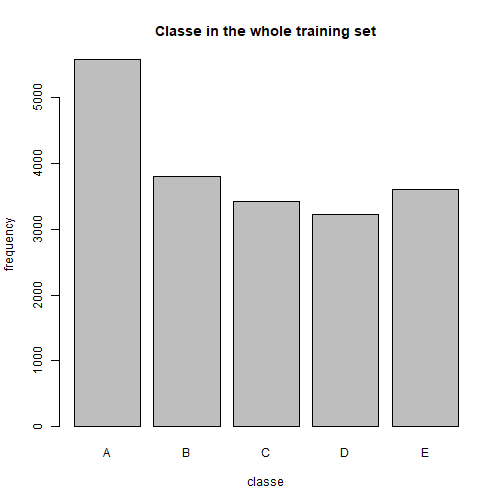
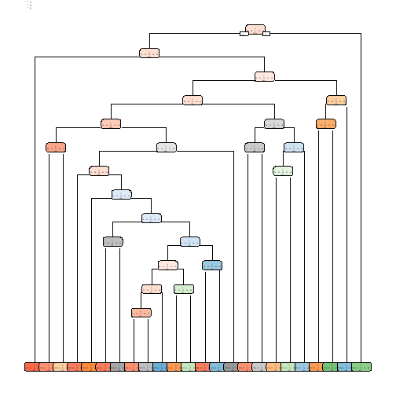
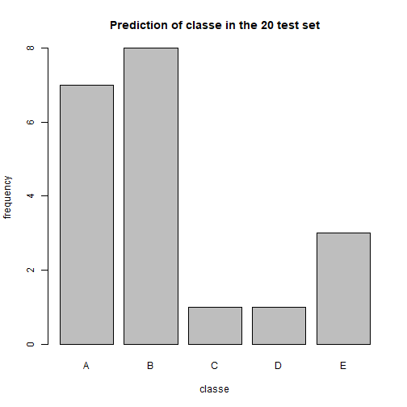

## Summary

The goal of the project is to explore the concept of human activity recognition, the project uses data from accelerometers on the belt, forearm, arm, and dumbell of 6 participants to predict the manner in which they did the exercise. This is the "classe" variable in the training set.
The report describes the model, cross validation, expected out of sample error, and why the choices are made. 
The prediction model is also used to predict 20 different test cases.

The data for this project come from this source: http://web.archive.org/web/20161224072740/http:/groupware.les.inf.puc-rio.br/har.

Six young health participants were asked to perform one set of 10 repetitions of the Unilateral Dumbbell Biceps Curl in five different fashions and classed as below: 

    A - exactly according to the specification  
    B - throwing the elbows to the front 
    c - lifting the dumbbell only halfway
    D - lowering the dumbbell only halfway
    E - throwing the hips to the front


# Import and clean data

```r
UrlTrain<-"https://d396qusza40orc.cloudfront.net/predmachlearn/pml-training.csv "

UrlTest<-"https://d396qusza40orc.cloudfront.net/predmachlearn/pml-testing.csv "

Training<-read.csv(url(UrlTrain))
Testing<-read.csv(url(UrlTest))

# Remove all 0 columns
Training<-Training[,colSums(is.na(Training)) == 0]
Testing <-Testing[,colSums(is.na(Testing)) == 0]

# Remove irrelavent columns such as user_name, raw_timestamp_part_1, raw_timestamp_part_2, cvtd_timestamp, new_window,num_window, column[1:7]
Training   <-Training[,-c(1:7)]
Testing <-Testing[,-c(1:7)]

# Remove dependent columns,
drops<-"kurtosis|skewness|max|min|amplitude|avg|stddev|var"
Training<-Training[,-grep(drops,colnames(Training))]

table(Training$classe)
```

```
## 
##    A    B    C    D    E 
## 5580 3797 3422 3216 3607
```

```r
plot(as.factor(Training$classe),main="Classe in the whole training set",xlab="classe",ylab="frequency")
```



# Load libraries and creat partitions of the training data into training set and test test


```r
library(caret)
library(randomForest)
library(rpart)
library(rpart.plot)

# Partitions into training set and test set, p=3/4

inTrain = createDataPartition(Training$classe, p = 3/4,list=FALSE)
train = Training[inTrain, ]
test = Training[-inTrain, ]
```
# Decision tree 


```r
mod_dt<-rpart(classe~.,data=train,method="class")
pred_dt<-predict(mod_dt,test,type="class")

rpart.plot(mod_dt,cex=0.2)
```

```
## Warning: labs do not fit even at cex 0.15, there may be some overplotting
```



```r
confusionMatrix(pred_dt, as.factor(test$classe))
```

```
## Confusion Matrix and Statistics
## 
##           Reference
## Prediction    A    B    C    D    E
##          A 1264  132   19   27   17
##          B   35  562   72   76   67
##          C   49  133  682  123  115
##          D   10   80   64  504   64
##          E   37   42   18   74  638
## 
## Overall Statistics
##                                           
##                Accuracy : 0.7443          
##                  95% CI : (0.7318, 0.7565)
##     No Information Rate : 0.2845          
##     P-Value [Acc > NIR] : < 2.2e-16       
##                                           
##                   Kappa : 0.6762          
##                                           
##  Mcnemar's Test P-Value : < 2.2e-16       
## 
## Statistics by Class:
## 
##                      Class: A Class: B Class: C Class: D Class: E
## Sensitivity            0.9061   0.5922   0.7977   0.6269   0.7081
## Specificity            0.9444   0.9368   0.8963   0.9468   0.9573
## Pos Pred Value         0.8663   0.6921   0.6189   0.6981   0.7886
## Neg Pred Value         0.9620   0.9054   0.9545   0.9283   0.9358
## Prevalence             0.2845   0.1935   0.1743   0.1639   0.1837
## Detection Rate         0.2577   0.1146   0.1391   0.1028   0.1301
## Detection Prevalence   0.2975   0.1656   0.2247   0.1472   0.1650
## Balanced Accuracy      0.9253   0.7645   0.8470   0.7868   0.8327
```
# Random forest 

```r
mod_rf<-randomForest(as.factor(classe) ~.,data=train)

pred_rf<-predict(mod_rf,test,type="class")

confusionMatrix(pred_rf, as.factor(test$classe))
```

```
## Confusion Matrix and Statistics
## 
##           Reference
## Prediction    A    B    C    D    E
##          A 1393    3    0    0    0
##          B    2  942    6    0    0
##          C    0    4  849    5    0
##          D    0    0    0  799    1
##          E    0    0    0    0  900
## 
## Overall Statistics
##                                           
##                Accuracy : 0.9957          
##                  95% CI : (0.9935, 0.9973)
##     No Information Rate : 0.2845          
##     P-Value [Acc > NIR] : < 2.2e-16       
##                                           
##                   Kappa : 0.9946          
##                                           
##  Mcnemar's Test P-Value : NA              
## 
## Statistics by Class:
## 
##                      Class: A Class: B Class: C Class: D Class: E
## Sensitivity            0.9986   0.9926   0.9930   0.9938   0.9989
## Specificity            0.9991   0.9980   0.9978   0.9998   1.0000
## Pos Pred Value         0.9979   0.9916   0.9895   0.9988   1.0000
## Neg Pred Value         0.9994   0.9982   0.9985   0.9988   0.9998
## Prevalence             0.2845   0.1935   0.1743   0.1639   0.1837
## Detection Rate         0.2841   0.1921   0.1731   0.1629   0.1835
## Detection Prevalence   0.2847   0.1937   0.1750   0.1631   0.1835
## Balanced Accuracy      0.9989   0.9953   0.9954   0.9968   0.9994
```
# Comparing results
Random forest perform better than decision tree. The accuracy of random forest is 0.995 ( 95% CI : (0.993, 0.997)) while decision tree only achieve accuracy of 0.7429 ( 95% CI : (0.7304, 0.755)). The random forest model will be used to predict the 20 different test cases

# Use random forest model to predict the 20 different cases
The prediction results of the 20 different test cases are shown as below.

```r
new_pred<-predict(mod_rf,Testing,type="class")
new_pred
```

```
##  1  2  3  4  5  6  7  8  9 10 11 12 13 14 15 16 17 18 19 20 
##  B  A  B  A  A  E  D  B  A  A  B  C  B  A  E  E  A  B  B  B 
## Levels: A B C D E
```

```r
plot(new_pred,main="Prediction of classe in the 20 test set",xlab="classe",ylab="frequency")
```



# write to file

```r
rmarkdown::render("Assignment.Rmd")
```

```
## 
## 
## processing file: Assignment.Rmd
```

```
## Error in parse_block(g[-1], g[1], params.src, markdown_mode): Duplicate chunk label 'setup', which has been used for the chunk:
## knitr::opts_chunk$set(echo = TRUE)
```
